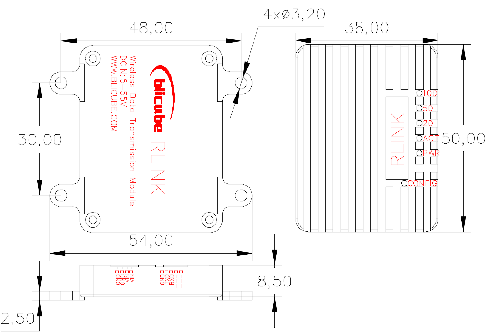
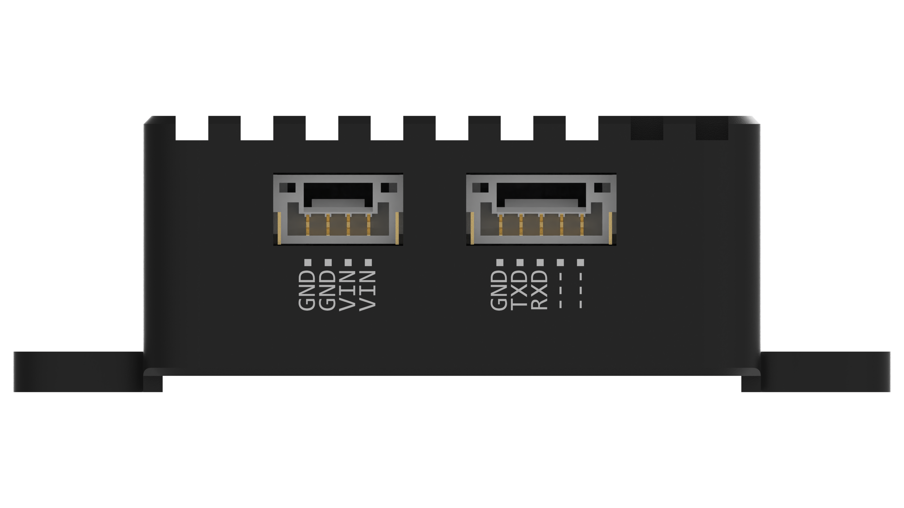
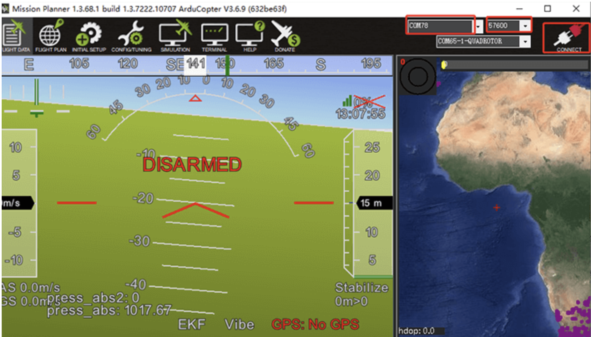
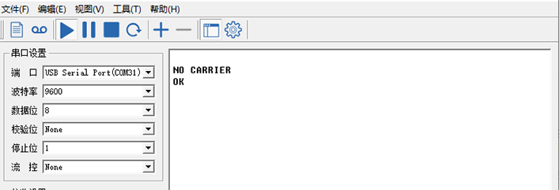

# RLINK用户手册

**版本**

| 版本号 | 日期          | 责任人 | 说明         |
|--------|---------------|--------|--------------|
| V1.0   | 2021年5月31日 | 清川   | 初始版本     |
| V2.0   | 2022年4月21日 | Alan   | 图片优化     |
| V2.1   | 2022年6月19日 | Alan   | 一站多机设置 |
|        |               |        |              |


**关于本手册的声明**

用户使用RLINK无线数据链路通讯模块，即视为自动接受本声明。

请用户在使用RLINK数传模块之前仔细阅读本手册，如有任何不明白的问题，请联系我们的技术支持邮箱junluster@163.com。


## 1系统介绍

### 1.1系统简介

RLINK是BLI（北力电子）研发的远距离无线数据链路通讯模块，既支持点对点通信模式，也支持一站多机。通过两个RLINK模块，一个接设备端、一个接电脑端，即可组成一对互相通信的数据链路。使用三个及以上RLINK模块，可用于一站多机。

RLINK模块基于P900模组设计，拥有高功率、高速率、高接收灵敏度等特性。地空通信距离高达30KM以上，设备为航空CNC外壳，发射功率可达1W，工业级工作范围（-40～80度），宽压输入（5～35V），高速跳频。


<center>

图1.1 RLINK系统实物图
</center>
**  
**

### 1.2技术参数

-   **性能指标**

| 项目                  | 参数                 |
|-----------------------|----------------------|
| 工作频率              | 902-928MHz           |
| 传输技术              | 跳频                 |
| 加密                  | Optional             |
| 最远通信距离 输入电压 | 60KM 5～35v          |
| 输出功率              | 100mW-1W（20-30dBm） |
| 串行接口              | 3.3V TTL             |
| 波特率（出厂）        | 57600（可改）        |
| 空速                  | 115 – 276 kbps       |
| 数据接口              | GH1.25-5P            |
| 天线接口              | SMA内针              |
| 工作温度              | -55～85度            |
| 尺寸                  | 50mm\*38mm\*14mm     |
| 重量                  | 39g                  |
| 功耗                  | 1.5W                 |

### 1.3尺寸与安装

模块尺寸如图1.2所示，安装孔位为直径3.2的通孔，适用于M3的螺柱安装。


<center>
图1.2尺寸示意图
</center>

## 2连接与使用

### 2.1接口定义

RLINK模块共有两个GH1.25的接口如图2.1所示。如图2.1左部分电源输入接口，可直接使用提供的电源接口配线使用；右部分为串口接口。


<center>

图2.1 RLINK接口图
</center>

### 2.2 出厂配置

出厂默认为空速115K，接口速率为57600，点对点广播模式。如需修改如波特率、空速、配置一站多机等模式，请参考第3部分自定义配置。

-   **与设备连接参考**

Pixhawk系列：插入到飞控的telem1或者telem2 接口。

其他硬件：请参考串口接口引脚图：RLINK的GND接设备的GND，RLINK的Tx接设备的Rx，RLINK的Rx接设备的Tx。

由于RLINK发射功率高达1W，部分pixhawk硬件数传口和地面站电脑无此供电能力，请给RLINK单独供电。

-   **地面站使用**

与PIX的地面站都兼容，mp地面站连接时请选择端口和波特率，点连接；qgc地面站插上后自动连接。

****
<center>
图2.2 MP地面站连接示意图
</center>

## 3 自定义配置

RLINK出厂时已经已经配置完成，一般不需要您进行本文的配置，如果您有需求可以根据下方说明进行自定义配置或联系我们技术支持。

### 3.1进入配置模式

先将RLINK通过数据线连接上电脑（配置模式下的串口波特率为**9600**），用顶针或其他设备按住RLINK的CONFIG按钮，然后开机，即可进入配置模式。成功进入到配置模式可看到，串口助手弹出NO CARRIER 0K提示即为已进入配置模式。



<center>
图3.1 成功进入配置模式示意图
</center>

在串口助手中填入参数后，点发送，就可以完成配置（配置成功后面都带有ok），注意配置命令后面需要加回车（ **CRLF** ）。

-   **常用参数说明**

```html
ATS101: 操作模式（0 – 主机；1 – 中转；2 – 从机）

ATS103: 通讯模式（0 – 点对多点；1 – 点对点）

ATS102: 串口波特率（0 - 230400；1 - 115200；2 - 57600；3 - 38400；4 - 28800；5 - 19200；6 - 14400；7 - 9600；8 - 7200；9 - 4800；10 - 3600；11 - 2400；12 - 1200；13 – 600；14 - 300）

ATS103: 空速（0 - 172800；1 - 230400；2 - 276480；3 - 57600；4 - 115200）

ATS108: 发射功率（20 - 100；21 - 125；22 - 160；23 - 200；24 - 250；25 - 320；26 - 400；27 - 500；28 - 630；29 - 900；30 -1000）

ATS104: 网络IP（1 \~ 4294967295）

ATS105: 设备地址(1 \~ 65535)

ATS140: 目标地址(1 \~ 65535)

AT&F10: 设置点对点主机的默认参数

AT&F11: 设置点对点从机的默认参数

AT&F12: 设置点对点中转的默认参数

AT&F7: 设置点对多点主机的默认参数

AT&F8: 设置点对多点从机的默认参数

AT&F9: 设置点对多点中转的默认参数
```


### 3.2 点对点模式通信配置

点对点模式只需复制下方参数粘贴至串口助手后，按回车键再点击发送，就可以完成配置（配置成功后面都带有ok）：

-   **主机设置（地面端） 参数：**

```html
ATS105范围：1；

ATS140范围：2 \~ 65535；
```

以下参数说明：设为主机模式、波特率为57600、空速为230400、网络IP1234567890、发射功率100mW、设备地址1、目标地址2。

**参数**

```html
AT&F10
ATS101=0
ATS102=2
ATS103=1
ATS104=1234567890
ATS108=20
ATS105=1
ATS140=2
AT&V
AT&W
```

- **从机设置（天空端） 参数：**

ATS105范围：2 \~ 65535；

ATS140范围：1；

以下参数说明：设为从机模式、波特率为57600、空速为230400、网络IP1234567890、发射功率100mW、设备地址2、目标地址1。

- **参数**

```html
AT&F11
ATS101=2
ATS102=2
ATS103=1
ATS104=1234567890
ATS108=20
ATS105=2
ATS140=1
AT&V
AT&W
```

### 3.3 一站多机模式配置

-   **设置参数示例：**

设为点对多点模式，波特率57600，空速115200（如果传输数据较大，请按实际需要调高相应的波特率和空速），发射功率1000mW，网络IP1239。

* 主机

```html
AT&F7
ATS102=2
ATS103=4
ATS104=1239
ATS105=1
ATS108=30
AT&W
```


* 从机1

```html
AT&F8
ATS102=2
ATS103=4
ATS104=1239
ATS105=2
ATS108=30
AT&W
ATA
```

* 从机2

```html
AT&F8
ATS102=2
ATS103=4
ATS104=1239
ATS105=2
ATS108=30
AT&W
ATA
```

* 从机3

```html
AT&F8
ATS102=2
ATS103=4
ATS104=1239
ATS105=4
ATS108=30
AT&W
ATA
```
**飞控参数设置:**<br>

如果您的RLINK套件已配置一站多机模式,<br>

* 分别将每台从机与主机连接，并设置对应飞控参数中 ```SYSID_THISMAV``` 为一个独特的值 (例如： “1” 作为第一台飞控设备, “2” 作为第二台, “3” 作为第三台).<br>
* 在地面站中, [减少数据传输量](https://ardupilot.org/plane/docs/common-mission-planner-telemetry-logs.html#common-mission-planner-telemetry-logs-setting-the-datarate) 至 ```最小需要的量``` 来避免通信带宽不够带来的链路阻塞问题.<br>

更多一站多机设置可参考:
```html
https://ardupilot.org/plane/docs/common-multi-vehicle-flying.html
```

## 4 注意事项

1、使用本公司RLINK套装，出厂已配置好，支持即插即用，若自己更改配置后RLINK不能正常使用，请联系客服。

2、本产品为无线数传链路，适用于无遮挡环境，稳定通信距离受实际应用场地的影响。

3、RLINK最大功率为5W，若电脑或设备不能正常工作，请检查RLINK供电。

4、若只是一对数传即点对点模式使用，移动端RLINK和地面端RLINK可任意互换使用；若为一站多机模式，不可互换使用。

## 5 RLINK购买

1、购买地址

淘宝店铺：北力电子

2、发货清单


3、物流

本店国内默认顺丰包邮，国外客户需根据实际情况采取合适的物流方式。

4、关于批发

根据批发数量的不同，批发价格不等，有批发需求请联系客服。
