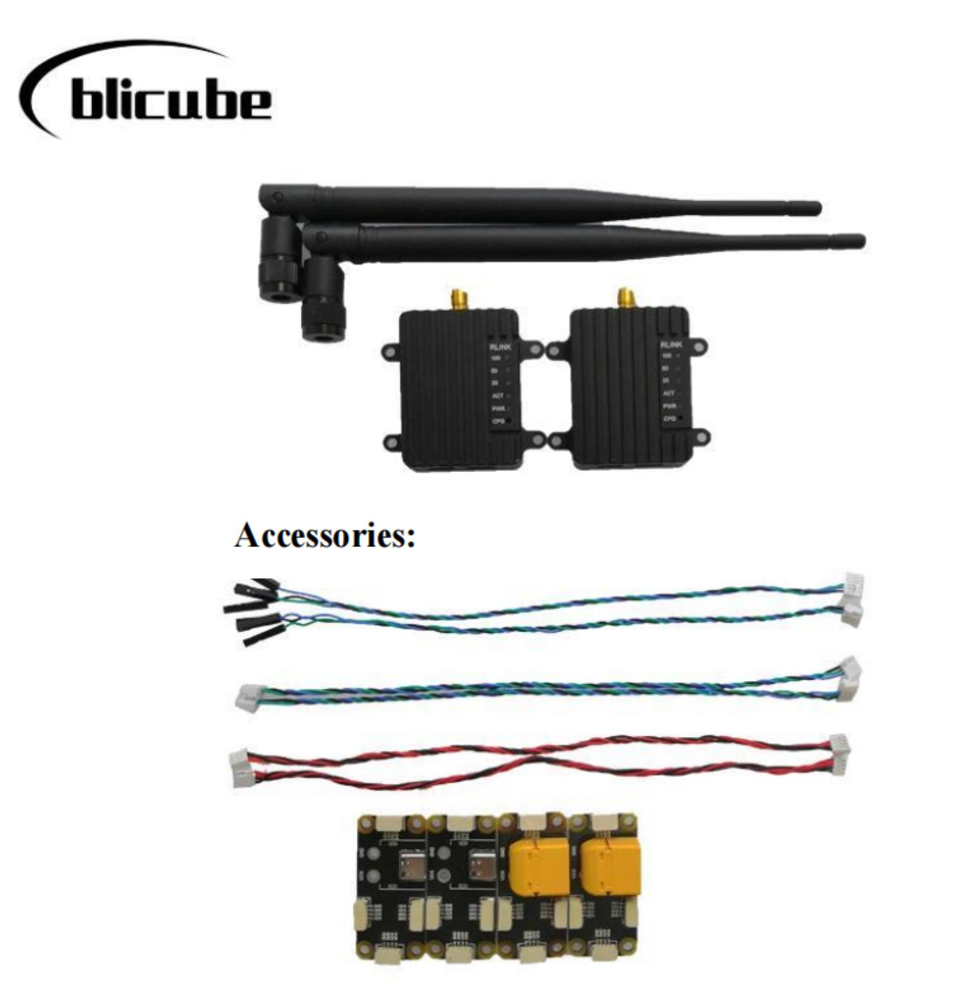

# RLINK Handbook
## Part 1 Introduction
### 1.1 Summary
**RLINK** is a long-distance wireless data link communication module developed by ***blicube.LLC***, supporting Point to Point and Point to Multipoint. Using two RLINK modules to form a pair of data links for mutual communication, when one connected to the device end and the other connected to the computer end. With three or more RLINK modules, it can be used for Point to Multipoint.

Based on bulid-in **P900** module, RLINK has the characteristics of high transmission power, high link rate, high receiving sensitivity, etc. The ground-to-air communication distance is up to **30+KM**, the transmitting power can reach  **1W** , besides the module supports wide voltage input (5～55V) and high-speed frequency hopping. The module has the operating temperature range of -40 to 80 degrees, with shell of CNC aviation aluminum alloy materials.

  
  
  Figure1.1

### 1.2 Technical Specifications
* Performance

|  Item |  Specification  |
|  --  |  -- |
|  Frequency |  902-928MHz  |
|  Spreading Method  |  Frequency Hopping  |
|  Encryption  |  Optional(see –AES option)  
|  Range  |  Up to 60 KM(in theory)
|  Forward Error Detection  |  Hamming BCH Golay Reed-Solomon
|  Error Detection  |  32 bits of CRC, ARQ
|  Output Power  |  100mW-1W（20-30dBm）
|  Serial Interface  |  3.3V TTL
|  Baud Rate  |  57600（default & changeable）
|  Link Rate  |  57.6 – 276 kbps
|  Sensitivity (@10^-4)  |  -114 dBm @ 57.6 kbps -112 dBm @ 115.2 kbps -109 dBm @ 172.8 kbps -107 dBm @ 230.4 kbps
|  Blocking  |  +/- 1 MHz > 55 dBc +/- 2.5 MHz > 60 dBc +/- 5 MHz > 65 dBc > 930 MHz > 70 dBc < 890 MHz > 70 dBc
|  Supply Voltage  |  5～35v
|  Antenna Interface  |  SMA
|  Size  |  50mm * 38mm * 14mm
|  Weight  |  39g  |
|  Power   |  1.5W |

### 1.3 Physical Dimension
The module size is shown in Figure 1.2. The mounting hole is a through hole with a diameter of 3.2, which is suitable for M3 bolt.

  
  
  Figure1.2
  

## Part 2 Use Guide
### 2.1 Interface
The RLINK module has two GH1.25 interfaces, shown in Figure 2 .1, where the left side is the power supply interface, which is recommended to use the provided circuit board for power supply, and the right side is a serial interface. 

  
  
  Figure2.1

### 2.2 Default Parameter
RLINK has been configured when you get it. The default link rate is 115 kbps, the boud rate of serial interface is 57600, and the default broadcast mode is Point to Point. If you want to modify the relevant parameters, please refer to Part 3 for custom configurations.
### 2.3 Communication
* **Pixhawk Flight Controller** Please connect the RLINK serial interface to controller’s Telem1 or Telem2 interface.
* **Other Devices** Please follow the interface definition to connect the RLINK serial interface to other device serial interface (RX-TX TX-RX GND-GND), if needed.

### 2.4 Power Suply
Since output power up to 1W, some controller’s and computer’s interfaces have not the ability to supply such high power, it is recommended strongly that using a separate battery to supply power for RLINK for the stability.
### 2.5 Ground Station 
Connect RLINK(the ground end) to computer as a monitor via a data cable, it can be auto connected when using QGroundControl. While when using Mission Planner as your ground station, it is necessary to select communication port and baud rate as shown in figure 2.2 at first, click CONNECT and then wait for the connection to complete. 

  
  
  Figure2.2

## Part 3 Configuration
RLINK has been configured at the factory and generally does not require additional configuration. If you need to modify the parameters, you can customize the configuration according to the instructions below.  
### 3.1 Enter Configuration Mode
Connect RLINK(the ground end) to the computer via a data cable at first, make sure the your serial assistant can communicate with RLINK, press and hold the RLINK CONFIG key with a thimble or other sharp object. The RLINK will enter configuration mode when the serial assistant pops up the NO CARRIER 0K prompt and then release CONFIG key.

  
  
  Figure3.1

After entering configuration mode, the configuration can be completed by sending the relevant parameters via the serial assistant (all with OK after successful configuration). Noting that every configuration command needs to be followed by a carriage return.
### 3.2 Common Commands Reference
* **Common commands** 
>ATS101: Operator Mode（0 – Master；1 –Repeater；2 – Slave） 
ATS133: Network Type（0 – Point to Mutlipoint；1 – Point to Point） 
ATS102: Serial Baud Rate（0 - 230400；1 - 115200；2 - 57600；3 - 38400；4 - 28800；5 - 19200；6 - 14400；7 - 9600；8 - 7200；9 - 4800；10 - 3600；11 - 2400；12 - 1200；13 – 600；14 - 300） 
ATS103: Wireless Link Rate（0 - 172800；1 - 230400；2 - 276480；3 - 57600；4 - 115200） 
ATS108: Output Power（20 - 100；21 - 125；22 - 160；23 - 200；24 - 250；25 - 320；26 - 400；27 - 500；28 - 630；29 - 900；30 -1000） 
ATS104: Network Address（1 ~ 4294967295） 
ATS105: Unit Address (1 ~ 65535) 
ATS140: Destination Address (1 ~ 65535)
* **Load Factory Default Configuration** 
>AT&F10: Master of Point to Point 
AT&F11: Slave of Point to Point 
AT&F12: Repeater of Point to Point 
AT&F7: Master of Point to Multipoint 
AT&F8: Slave of Point to Multipoint  
AT&F9: Repeater of Point to Multipoint

### 3.3 Point to Point Configuration
Please copy the reference commands to the serial assistant, press enter and then click Send, and the configuration is successful with OK:
#### **Master (ground end) parameter settings：**
* Note： 
ATS105: 1; 
ATS140: from 2 to 65535.
* Example: 
Set to Master mode, Baud rate of 115200, Link rate of 230400, Network address 1234567890, Output power 100mW, Unit address 1, Destination address 2. 
Please follow commands below to set RLINK:
> ---
>AT&F10 
ATS101=0 
ATS102=1 
ATS103=1 
ATS104=1234567890 
ATS108=20 
ATS105=1 
ATS140=2 
AT&V 
AT&W
> ---
#### **Slave (remote) parameter settings：**
* Note： 
ATS105: from 2 to 65535; 
ATS140: 1.
* Example: 
Set to Slave mode, Baud rate of 115200, Link rate of 230400, Network address 1234567890, Output power 100mW, Unit address 2, Destination address 1. 
Please follow commands below to set RLINK:
> ---
>AT&F11 
ATS101=2 
ATS102=1 
ATS103=1 
ATS104=1234567890 
ATS108=20 
ATS105=2 
ATS140=1 
AT&V 
AT&W
> ---

### 3.4 Point to Mutlipoint Configuration
**EXAMPLE：** 

* Master

> ---
>AT&F7 
ATS102=2 
ATS103=4 
ATS104=1239 
ATS105=1 
ATS108=30 
AT&W 
ATA
> ---

* Slave1
> ---
>AT&F8 
ATS102=2 
ATS103=4 
ATS104=1239 
ATS105=2 
ATS108=30 
AT&W 
ATA
> ---
* Slave2
> ---
>AT&F8 
ATS102=2 
ATS103=4 
ATS104=1239 
ATS105=2 
ATS108=30 
AT&W 
ATA
> ---
* Slave3
> ---
>AT&F8 
ATS102=2 
ATS103=4 
ATS104=1239 
ATS105=4 
ATS108=30 
AT&W 
ATA
> ---
## Part 4 Precautions
* RLINK has been configured to be ready to use, if you modify the parameters of RLINK that cannot be used normally, please contact customer service.
* This product is a wireless digital transmission link, suitable for unobstructed environment, stable communication distance by the impact of the actual application site.
* RLINK has a maximum power of 5W, and if your computer or RLINK is not working properly, check the RLINK power supply. 
* Remote RLINK and ground-end RLINK can be used interchangeably if used in Point to Point mode, and not interchangeable in Point to Mutlipoint mode. 

## Part 5 Purchase
### 5.1 The Link to Purchase
AliExpress: <a href="https://pt.aliexpress.com/item/1005003061008680.html?spm=a2g0o.productlist.0.0.1ca3170aooF0vd&algo_pvid=fb3c219b-6ce4-468c-9860-e3b14fab8904&algo_exp_id=fb3c219b-6ce4-468c-9860-e3b14fab8904-30&pdp_ext_f=%7B%22sku_id%22%3A%2212000023685425338%22%7D" target="_blank">RLINK</a>
### 5.2 The List of a RLINK Kit

  
  
  Figure5.1

### 5.3 Express Delivery
Appropriate logistics methods need to be adopted according to the actual situation.
### 5.4 Wholesale
Wholesale prices vary depending on the quantity of the wholesale, please contact customer service for more details.
